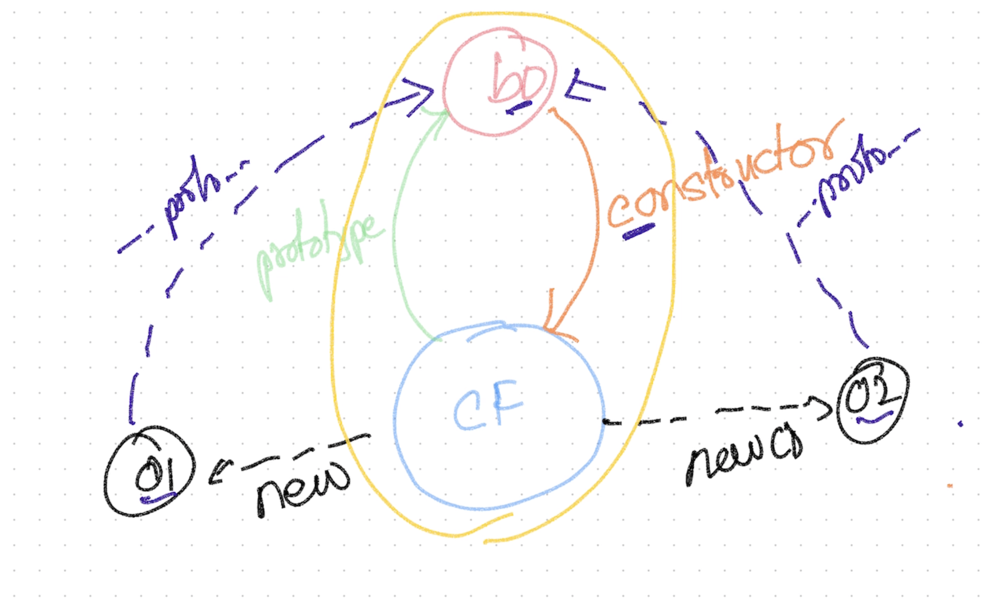
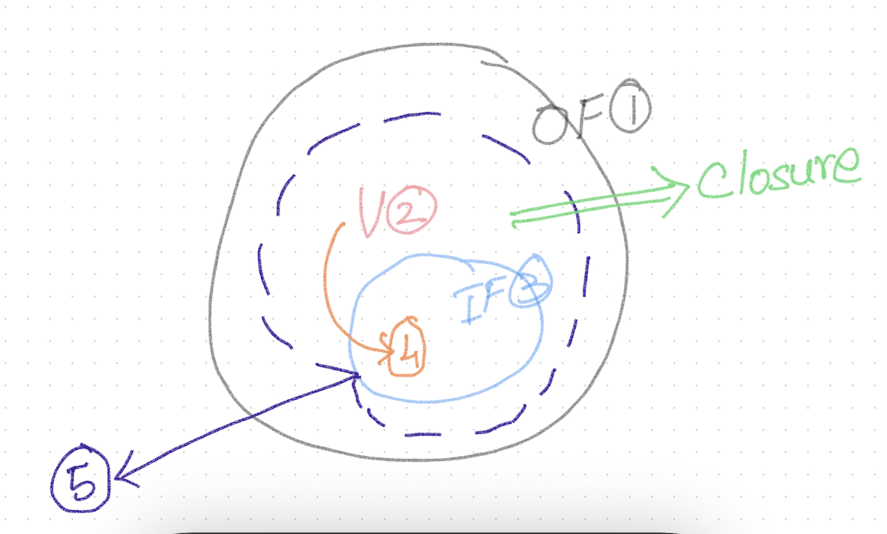

# TypeScript?

- Helps in ensuring type safety
- **Compile-time** type check
- JavaScript is a loosely typed language

## How to take advantage of the loosely typed nature of JS?
```
// C#
// Declaration
int x;
x = 100;
x = "This is a sample text" //<- compilation error
```

```
// JS
let x;
x = 100
x = "This is a string"
x = true
x = []
x = {}
x = function(){}
```

```
/* Write a function to add 2 number */
function add(x,y){
    if (typeof x !== 'number' || typeof y !== 'number'){
        throw new Error("invalid arguments")
    }
    return x + y;
}
```

```
function add(){
    function parseArg(n){
        if (typeof n === 'function') return parseArg(n());
        if (Array.isArray(n)) return add.apply(this, n);
        return isNaN(n) ? 0 : parseInt(n);
    }
    return arguments.length <= 1 ? parseArg(arguments[0]) : parseArg(arguments[0]) + add.apply(this, Array.prototype.slice.call(arguments,1));
}
```

```
function add(...args){
    function parseArg(n){
        if (typeof n === 'function') return parseArg(n());
        if (Array.isArray(n)) return add(...n);
        return isNaN(n) ? 0 : parseInt(n);
    }
    return args.length <= 1 ? parseArg(args[0]) : parseArg(args[0]) + add(args.slice(1));
}
```

- add(10,20)
- add(10)
- add()
- add(10,"20")
- add(10,"abc")
- add([10,20],[30,40])
- add([10,20],[30,"40"])
- add([10,20],[30,"abc"])
- add([10,20],[[30,"abc"],40])
- add(function(){ return 10; }, function(){ return  20; })
- add([function(){ return [10,20]; }, function(){ return  [[30,"abc"],40]; }])
- add(function(){ return [function(){ return [10,20]; }, function(){ return  [[30,"abc"],40]; }] })

**jQuery**
```
$(domNode)
$([domNode1, domNode2...])
$(string)
$(document).ready(function(){})
$(function(){})
$($el)
```

**JS Fundamentals**
- arguments?
- add.apply?
- Array.prototype.slice.call()?

**Functions :**
Whenever a function is invoked, there 2 implicit values that are passed to the function by default
- arguments
    - an ***array like*** object containing all the argument values passed to the function
    - arguments.length => # of arguments passed to the function
    - arguments[0]
    - arguments[1]
    - ....
- this

### Important: ###
- It DOES NOT matter **WHERE** the function is OR **WHO** owns the function
- What matters is **HOW** the function is invoked

## Function Invocation Patterns (6 ways) ##
### this -> Invocation context ###

1. When a function is invoked as a **method** of an obj
    - this -> obj
    ```
        let emp = {
            name : 'Magesh'
        }
        function whoAmI(){
            console.log('I am ', this.name)
        }
        emp['whoAmI'] = whoAmI
        emp.whoAmI()
    ```
2. When a function is invoked as a **function**
    - this -> global scope ( window object in the browser )
    ```
        function whoAmI(){
            console.log('I am ', this.name)
        }
        whoAmI()
    ```
3. Using the **call** method of the function
    ```
        function fn(){
            console.log('fn invoked');
        }
        fn()
        fn.call()

        //dynamically set the this context when the function is executed
        let emp = {
            name : 'Magesh'
        }
        
        function whoAmI(){
            console.log('I am ', this.name)
        }

        whoAmI.call(emp)

        /////////////
        let emp = {
            name : 'Magesh',
            whoAmI : function(){
                console.log('I am ', this.name);
            }
        }
        emp.whoAmI()
        var product = {
            name : 'Pen'
        }
        emp.whoAmI.call(product)
        ////////////////
        function greet(salutation, msg){
            console.log(salutation + this.name + ', ' + msg);
        }
        
        let emp = {
            name : 'Magesh'
        }
        
        greet.call(emp, 'Mr.', 'Have a nice day!')
    ```
4. Using the **apply** method of the function
    ```
        function fn(){
            console.log('fn invoked');
        }
        fn()
        fn.apply()

        //dynamically set the this context when the function is executed
        let emp = {
            name : 'Magesh'
        }
        
        function whoAmI(){
            console.log('I am ', this.name)
        }
        
        whoAmI.apply(emp)
        ////////////////
        function greet(salutation, msg){
            console.log(salutation + this.name + ', ' + msg);
        }
        
        let emp = {
            name : 'Magesh'
        }
        
        greet.apply(emp, ['Mr.', 'Have a nice day!'])
    ```

    ### Using bind() ###
    ```
        let emp = {
            name : 'Magesh',
            whoAmI : function(){
                console.log('I am ', this.name)
            }
        }
                 
        emp.whoAmI = emp.whoAmI.bind(emp)
        emp.whoAmI()
        
        window.name = 'Chrome Browser'
        var whoAmI = emp.whoAmI;
        whoAmI()

        var product = {
            name : 'Pen'
        }
        emp.whoAmI.call(product)
    ```

5. Using the **new** method of the function
    ### Constructor Function ###
    **A function that behaves like a 'class' on OO languages**
    - There is no syntax difference between a normal function and a constructor function
    - Constructor functions are invoked with the **new** keyword
        - this -> new object
        - this -> returned by default
    - A constructor function's name must start with an uppercase (convention)

    ```
        function Employee(id, name, salary){
            //this -> new object
            this.id = id;
            this.name = name;
            this.salary = salary;
            //this -> returned by default
        }
        var emp = new Employee(100, 'Magesh', 10000)
        emp instanceof Employee
    ```
6. As an "Immediately Invoked Function Expression / IIFE"

## Prototypal Inheritance ##
### One object acts as a base object for a family of objects ###

- Every object has a hidden  **\_\_proto\_\_**  attribute that maintains a reference to the base object
- "Prototype hopping" happens ONLY while reading an attribute value.



```
    function Employee(id, name, salary){
        //this -> new object
        this.id = id;
        this.name = name;
        this.salary = salary;
        //this -> returned by default
    }
    Employee.prototype.display = function(){
        console.log(this.id, this.name, this.salary);
    }

    var e1 = new Employee(100, 'Magesh', 10000)
    e1.display()

    var e2 = new Employee(200, 'Suresh', 20000)
    e2.display()

    var dummy = { id : 300, name : 'Rajesh', salary : 30000 }
    e1.display.call(dummy)
    OR
    Employee.prototype.display.call(dummy)
```

## Closures ##

Modify the click-tracker.html to implement printing the number of times the button is clicked



```
    //Create an object and assign it to a variable called spinner
    //the object must have the following behavior
    var spinner = /* .... */
    spinner.up() // return 1
    spinner.up() // return 2
    spinner.up() // return 3
    spinner.up() // return 4

    spinner.down() // return 3
    spinner.down() // return 2
    spinner.down() // return 1
    spinner.down() // return 0
    spinner.down() // return -1

    IMPORTANT:
        - Ensure that the behavior of the spinner object is NOT influenceable from outside
        - NO HTML, NO BUTTON, NO Click event handler etc

    SOLUTION:
        //singleton
        var spinner = (function(){
            var count = 0;

            function up(){
                return ++count;
            }
            function down(){
                return --count;
            }
            var spinner = { up : up, down : down }
            return spinner;
        })();

        //factory to create multiple instances
        function spinnerFactory(){
            var count = 0;

            function up(){
                return ++count;
            }
            function down(){
                return --count;
            }
            var spinner = { up : up, down : down }
            return spinner;
        }
        var spinner1 = spinnerFactory()
        var spinner2 = spinnerFactory()

```

```
    var products = [
        { id: 6, name: 'Pen', cost: 50, units: 20, category: 'stationary' },
        { id: 9, name: 'Ten', cost: 70, units: 70, category: 'stationary' },
        { id: 3, name: 'Len', cost: 60, units: 60, category: 'grocery' },
        { id: 5, name: 'Zen', cost: 30, units: 30, category: 'grocery' },
        { id: 1, name: 'Ken', cost: 20, units: 80, category: 'utencil' },
        { id: 7, name: 'Mouse', cost: 100, units: 20, category: 'electronics' }
    ];

    /* Version 1.0 */
    //finding costly products
    function costlyProductPredicate(product){
        return product.cost > 60
    }
    var costlyProducts = products.filter(costlyProductPredicate);
    console.table(costlyProducts)

    //finding affordable products
    function affordableProductPredicate(product){
        return !costlyProductPredicate(product);
    }
    var affordableProducts = products.filter(affordableProductPredicate)
    console.table(affordableProducts);

    //finding underStocked products
    function underStockedProductPredicate(product){
        return product.units <= 50;
    }
    var underStockedProducts = products.filter(underStockedProductPredicate);
    console.table(underStockedProducts);

    //finding wellSocked products
    function wellStockedProductPredicate(product){
        return !underStockedProductPredicate(product)
    }
    var wellStockedProducts = products.filter(wellStockedProductPredicate);
    console.table(wellStockedProducts);

    /* Version - 2.0 */
    //utility function (negate) to create the negated version of a given predicate
    function negate(predicateFn){
        /* 
        return function(product){
            return !predicateFn(product)
        } 
        */
        
        //generic version to handle varying number of arguments
        // ES5
        /*
        return function () {
            return !predicateFn.apply(this, arguments)
        }
        */

        //ES6
        return function(...args){
            return !predicateFn(...args)
        }
    }

    //finding costly products
    function costlyProductPredicate(product) {
        return product.cost > 60
    }
    var costlyProducts = products.filter(costlyProductPredicate);
    console.log("coslty products")
    console.table(costlyProducts)

    //finding affordable products
    /* 
    function affordableProductPredicate(product) {
        return !costlyProductPredicate(product);
    } 
    */
    var affordableProductPredicate = negate(costlyProductPredicate);

    var affordableProducts = products.filter(affordableProductPredicate)
    console.log("affordable products")
    console.table(affordableProducts);

    //finding underStocked products
    function underStockedProductPredicate(product) {
        return product.units <= 50;
    }
    var underStockedProducts = products.filter(underStockedProductPredicate);
    console.log("understocked products")
    console.table(underStockedProducts);

    //finding wellSocked products
    /* 
    function wellStockedProductPredicate(product) {
        return !underStockedProductPredicate(product)
    } 
    */
    var wellStockedProductPredicate = negate(underStockedProductPredicate);

    var wellStockedProducts = products.filter(wellStockedProductPredicate);
    console.log("well stocked products")
    console.table(wellStockedProducts);
```

### Sorting ###
```
    sort the products in ascending & descending by any attribute

    //Ascending by Id
    function compareProductById(p1, p2){
        if (p1.id < p2.id) return -1;
        if (p1.id > p2.id) return 1;
        return 0;
    }

    console.table(products.sort(compareProductById))


    function getDescComparer(comparerFn){
        return function(p1, p2){
            return comparerFn(p1, p2) * -1;
        }
    }

    //Descending by Id
    var compareProductByIdDesc = getDescComparer(compareProductById)
    console.table(products.sort(compareProductByIdDesc))

    //Ascending by Name
    function compareProductByName(p1, p2){
        if (p1.name < p2.name) return -1;
        if (p1.name > p2.name) return 1;
        return 0;
    }

    //Descending by Name
    var compareProductByNameDesc = getDescComparer(compareProductByName)
    console.table(products.sort(compareProductByNameDesc))


    //comparer factory
    function getComparer(attrName){
        return function(p1, p2){
            if (p1[attrName] < p2[attrName]) return -1;
            if (p1[attrName] > p2[attrName]) return 1;
            return 0;
        }
    }

    console.table(products.sort(getComparer('cost')))
    console.table(products.sort(getDescComparer(getComparer('cost'))))

```